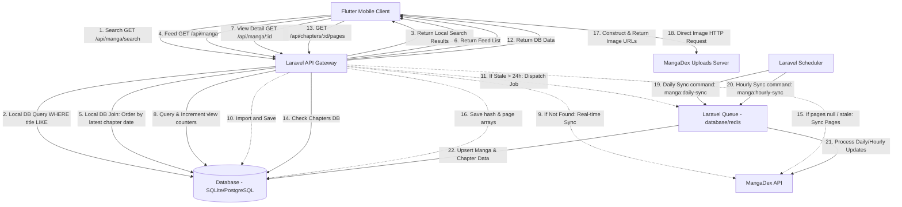

# Manga Reader Backend - System Design & Architecture

This document describes the structural components, data models, queue system, and external integrations for the Manga Reader Backend.

---

## 1. System Interaction Diagram

The diagram below illustrates the updated database-first architecture showing local search/feed flows and background synchronization.



---

## 2. Modular Domain Architecture

The application follows Domain-Driven Design (DDD) principles. Instead of using standard Laravel directories, all files are contained inside `app/Domains/`. 

```
app/
├── Domains/
│   ├── Users/
│   │   ├── Models/
│   │   │   └── User.php                # Overrides default app/Models/User.php
│   │   ├── Controllers/
│   │   │   └── AuthController.php      # Registration, Login, Logout
│   │   ├── DTOs/
│   │   │   └── UserDTO.php
│   │   ├── Requests/
│   │   │   ├── RegisterRequest.php
│   │   │   └── LoginRequest.php
│   │   └── Services/
│   │       └── AuthService.php         # Password hashing, token generation
│   │
│   ├── Mangas/
│   │   ├── Models/
│   │   │   └── Manga.php               # Stores manga metadata
│   │   ├── Controllers/
│   │   │   └── MangaController.php     # Feed, Search, Details
│   │   ├── DTOs/
│   │   │   ├── MangaDTO.php
│   │   │   └── SearchMangaDTO.php
│   │   ├── Repositories/
│   │   │   └── MangaRepository.php     # Database read/writes
│   │   ├── Jobs/
│   │   │   └── SyncMangaDetailsJob.php # Background sync worker
│   │   ├── Services/
│   │   │   ├── MangaService.php        # Internal logic & orchestrations
│   │   │   └── MangaDexService.php     # External MangaDex client wrapper
│   │   └── Actions/
│   │       └── SyncMangaAction.php     # Business action for syncing details
│   │
│   └── Chapters/
│       ├── Models/
│       │   └── Chapter.php             # Stores chapter info & page lists
│       ├── Controllers/
│       │   └── ChapterController.php    # Pages retrieval
│       ├── DTOs/
│       │   ├── ChapterDTO.php
│       │   └── ChapterPagesDTO.php
│       ├── Repositories/
│       │   └── ChapterRepository.php   # Database read/writes
│       ├── Services/
│       │   └── ChapterService.php      # Local chapter operations
│       └── Actions/
│           └── SyncChapterPagesAction.php # Business action for @Home fetching
```

### Route Registrations
To keep Laravel routing simple and clean, routes will be defined in `routes/api.php` and map directly to Domain controllers:
- `App\Domains\Users\Controllers\AuthController`
- `App\Domains\Mangas\Controllers\MangaController`
- `App\Domains\Chapters\Controllers\ChapterController`

---

## 3. Database Schema Design

### 3.1 Migration `create_users_table`
Stores user authentication details.
```php
Schema::create('users', function (Blueprint $table) {
    $table->id();
    $table->string('name');
    $table->string('email')->unique();
    $table->string('password');
    $table->timestamps();
});
```

### 3.2 Migration `create_mangas_table`
Stores metadata for synced mangas, along with tracking columns for activity identification. The primary key matches the MangaDex UUID.
```php
Schema::create('mangas', function (Blueprint $table) {
    $table->uuid('id')->primary(); // MangaDex Manga UUID
    $table->string('title');
    $table->text('description')->nullable();
    $table->string('cover_filename')->nullable();
    $table->string('status')->nullable();
    $table->timestamp('last_synced_at')->nullable();
    $table->timestamp('last_viewed_at')->nullable(); // Track activity for hourly updates
    $table->unsignedInteger('views_count')->default(0); // Track overall popularity
    $table->timestamps();
    
    // Indexes
    $table->index('title');
    $table->index('last_viewed_at'); // Indexed for fast active-checking queries
});
```

### 3.3 Migration `create_chapters_table`
Stores metadata, hashes, and page filenames for chapters. The primary key matches the MangaDex UUID.
```php
Schema::create('chapters', function (Blueprint $table) {
    $table->uuid('id')->primary(); // MangaDex Chapter UUID
    $table->uuid('manga_id');
    $table->string('title')->nullable();
    $table->string('chapter_number'); // e.g. "1", "1.5", "100a"
    $table->string('volume_number')->nullable();
    $table->string('language')->default('en');
    $table->string('hash')->nullable(); // MangaDex hash, populated on-demand
    $table->json('pages')->nullable(); // Original filenames, populated on-demand
    $table->json('pages_saver')->nullable(); // Compressed filenames, populated on-demand
    $table->timestamp('last_synced_at')->nullable();
    $table->timestamps();

    // Constraints & Indexes
    $table->foreign('manga_id')->references('id')->on('mangas')->onDelete('cascade');
    $table->index('manga_id');
    $table->unique(['manga_id', 'chapter_number', 'language']); // Avoid duplicate chapters for same language
});
```

### 3.4 Migration `create_personal_access_tokens_table`
Standard Sanctum migration to manage tokens.
*(Created automatically via `php artisan install:api`)*.

---

## 4. Queue, Cache, and Scheduler Design

### 4.1 Search and Feed
Search and feed listings query the database directly. Results are paginated. Cache is not strictly required for local DB queries but standard database query optimization indices are defined.

### 4.2 real-time & Background Sync Flow
The synchronization logic uses a hybrid on-demand + background pattern to guarantee data availability with minimal API latency:

1. **Synchronous Fetch (First Visit)**: When a manga is requested that is not present in the DB, details and chapters are fetched synchronously from MangaDex.
2. **Details Visit Counter**: Every time `GET /api/manga/{id}` is visited, we increment the `views_count` and update `last_viewed_at = now()`.
3. **Asynchronous Fetch (Stale check)**: If the manga exists but `last_synced_at` is older than 24 hours:
   - The old DB values are returned immediately to the client.
   - `SyncMangaDetailsJob` is dispatched to the Laravel queue.
   - The queue worker updates the DB with fresh details and chapter lists.
4. **Chapter Pages On-Demand Sync**: When pages of a chapter are requested:
   - If `hash` or `pages` is null, or `last_synced_at` is older than 24 hours, perform a synchronous At-Home server API call.
   - Store results in DB and return constructed URLs.

### 4.3 Background Job: `SyncMangaDetailsJob`
- **Class**: `App\Domains\Mangas\Jobs\SyncMangaDetailsJob`
- **Queue**: `default`
- **Parameters**: `string $mangaId`
- **Logic**:
  1. Call `MangaDexService` to retrieve details and cover art for `$mangaId`.
  2. Call `MangaDexService` to retrieve the latest feed/chapters.
  3. Update/Insert the manga details.
  4. Perform an `upsert` for chapters, adding new chapters and updating existing ones. Remove any chapters that were deleted from MangaDex.
  5. Update `last_synced_at = now()` on the manga.

### 4.4 Scheduled Tasks
The scheduler coordinates two tasks to maintain data freshness:

#### 1. Daily Sync: Discover New Manga
- **Command**: `manga:daily-sync`
- **Schedule**: Daily at midnight (`daily()`).
- **Goal**: Import newly updated mangas on MangaDex so they appear in local searches and the homepage feed.
- **Command Logic**:
  1. Call MangaDex endpoint `GET https://api.mangadex.org/manga?limit=100&order[latestUploadedChapter]=desc&includes[]=cover_art`.
  2. For each manga returned:
     - Dispatches `SyncMangaDetailsJob` to sync details and chapter list.

#### 2. Hourly Sync: Refresh Active Manga
- **Command**: `manga:hourly-sync`
- **Schedule**: Hourly (`hourly()`).
- **Goal**: Maintain updated chapters for active mangas (viewed within the last 7 days).
- **Command Logic**:
  1. Fetch all `id` from `mangas` table where `last_viewed_at >= now() - 7 days`.
  2. For each manga, dispatch `SyncMangaDetailsJob`.
  3. Throttle/delay job dispatches to respect MangaDex rate limits.

```php
// routes/console.php configuration
use Illuminate\Support\Facades\Schedule;

Schedule::command('manga:daily-sync')->daily();
Schedule::command('manga:hourly-sync')->hourly();
```

---

## 5. Environment Variables (.env)

The following parameters must be configured in the `.env` file to control the external API integrations:

```env
# MangaDex API Configuration
MANGADEX_API_URL=https://api.mangadex.org
MANGADEX_UPLOADS_URL=https://uploads.mangadex.org

# Stale data expiration (in seconds)
# 24 hours = 86400 seconds
MANGADEX_SYNC_STALE_TTL=86400

# Queue Driver
QUEUE_CONNECTION=database
```
